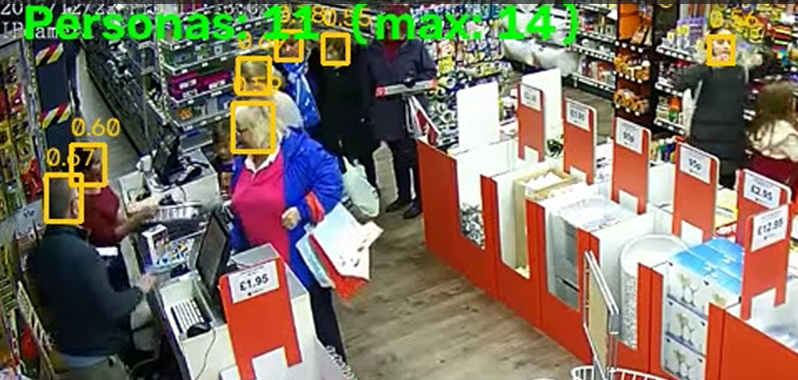

# Detection Plugin

Plugin independiente de **detección de objetos y personas** para el pipeline de Computer Vision. Permite ejecutar diferentes modelos YOLO y visualizar las detecciones directamente sobre los frames.

El plugin puede funcionar de dos maneras:

* **Standalone:** recibe directamente una fuente de video/cámara y ejecuta el modelo localmente.
* **IPC / MediaBus:** recibe frames y/o resultados desde los módulos del pipeline mediante comunicación entre procesos.

> La lógica general del runtime de inferencia se encuentra documentada en [`topics/02-inference-runtime`](../../topics/02-inference-runtime/README.md).

---

## Modelos incluidos

Actualmente el plugin incorpora diferentes modelos orientados a escenarios de detección general y conteo de personas.

| Modelo                           | Tipo             | Detección principal          | Formato |
| -------------------------------- | ---------------- | ---------------------------- | ------- |
| **YOLO26s**                      | Object Detection | Objetos, incluyendo `person` | `.pt`   |
| **YOLO11x**                      | Object Detection | Objetos, incluyendo `person` | `.pt`   |
| **YOLOv8s**                      | Object Detection | Objetos, incluyendo `person` | `.pt`   |
| **iRail Crowd Counting YOLOv8n** | Head Detection   | Cabezas de personas          | `.pt`   |

El modelo **iRail Crowd Counting YOLOv8n** está especializado en la detección de **cabezas de personas**, por lo que puede utilizarse en escenarios donde el objetivo es estimar o contar personas en situaciones de alta densidad.

Modelo:

[`irail-crowd-counting-yolov8n.pt`](https://github.com/NayeliSilva2322/count_people/blob/main/people-counter-youtube/models/irail-crowd-counting-yolov8n.pt)

### Diferencia entre detección de personas y detección de cabezas

Los modelos YOLO de detección de objetos normalmente producen bounding boxes alrededor del **cuerpo/persona completa**:

<p align="center">
  
</p>


El modelo de crowd counting produce bounding boxes alrededor de la **cabeza**:

<p align="center">
  
</p>

Esto permite utilizar estrategias diferentes dependiendo del escenario:

* **Detección de personas:** seguimiento, clasificación y análisis de objetos.
* **Detección de cabezas:** conteo de personas en multitudes y escenas donde el cuerpo puede estar parcialmente oculto.

---

## Inferencia

El componente `Infer` es responsable de ejecutar el modelo de detección y producir bounding boxes.

Una detección contiene conceptualmente:

```text
class
confidence
x1, y1, x2, y2
```

Por ejemplo:

```text
person
0.91
(320, 120, 510, 480)
```

El resultado puede ser enviado al pipeline de tracking o utilizado directamente para visualización.

> Este plugin **no realiza Multi-Object Tracking (MOT)**. Si se necesitan IDs persistentes para las personas detectadas, utilizar [`plugins/tracking`](../tracking/README.md).

---

# Arquitectura

El plugin puede integrarse con el pipeline mediante **MediaBus / IPC**.

```text
                    ┌──────────────────────┐
                    │  01 Capture Runtime  │
                    │                      │
Camera / Video ────►│       Frames         │
                    └──────────┬───────────┘
                               │
                               │ MediaBus / IPC
                               ▼
                    ┌──────────────────────┐
                    │ 02 Inference Runtime │
                    │                      │
                    │      InferSlot       │
                    └──────────┬───────────┘
                               │
                               │ Detection results
                               ▼
                    ┌──────────────────────┐
                    │ Detection Plugin     │
                    │                      │
                    │ YOLO26s / YOLO11x    │
                    │ YOLOv8s / Head YOLO  │
                    └──────────┬───────────┘
                               │
                               ▼
                    ┌──────────────────────┐
                    │ Tracking / Display   │
                    └──────────────────────┘
```

---

# MediaBus / IPC

Cuando **IPC está habilitado**, el plugin se conecta al pipeline existente y utiliza los datos compartidos mediante MediaBus.

En este modo, el plugin puede utilizar los resultados generados por el runtime de inferencia y encargarse de filtrarlos y visualizarlos.

### Ejecución

#### Terminal A — Captura

```bash
python topics/01-capture-runtime/run.py \
    --source 0 \
    --no-consumer
```

#### Terminal B — Inference Runtime

```bash
python topics/02-inference-runtime/run.py \
    --ipc cam0 \
    --device 0
```

#### Terminal C — Detection Plugin

```bash
python plugins/detection/ultralytics/run.py \
    --ipc cam0 \
    --imshow
```

El flujo es:

```text
Camera
   │
   ▼
Capture Runtime
   │
   │ frames
   ▼
MediaBus: cam0
   │
   ▼
Inference Runtime
   │
   │ InferSlot
   ▼
Detection Plugin
   │
   ▼
Visualization
```

---

# Standalone

También es posible ejecutar el detector sin utilizar MediaBus.

En este modo, el plugin recibe directamente una fuente de video y ejecuta el modelo seleccionado.

```bash
python plugins/detection/ultralytics/run.py \
    --source data/videos/trackdm1.mp4 \
    --device 0 \
    --imshow \
    --imshow-scale 0.5
```

Este modo es útil para:

* pruebas rápidas de modelos;
* validación de pesos;
* comparación entre modelos;
* debugging;
* desarrollo local;
* evaluación sobre videos.

---

# Selección del modelo

El modelo puede configurarse mediante YAML.

Ejemplo:

```yaml
run:
  model: models/detection/yolo26s.pt
  confidence: 0.25
  classes: [person]
  imgsz: 640
  device: 0
```

Para utilizar otro modelo:

```yaml
run:
  model: models/detection/yolo11x.pt
```

o:

```yaml
run:
  model: models/detection/yolov8s.pt
```

Para detección de cabezas:

```yaml
run:
  model: models/detection/irail-crowd-counting-yolov8n.pt
```

---

# Filtro de clases

`run.classes` permite seleccionar qué clases serán conservadas después de la inferencia.

| Valor                  | Comportamiento                                  |
| ---------------------- | ----------------------------------------------- |
| `null`                 | Mantiene todas las clases                       |
| `[person]`             | Mantiene únicamente personas                    |
| `[car, truck]`         | Mantiene vehículos seleccionados                |
| `[0, 2]`               | Filtra utilizando IDs de clase                  |
| `--classes person car` | Sobrescribe la configuración para una ejecución |

Ejemplo:

```yaml
run:
  model: models/detection/yolo26s.pt
  classes: [person]
```

Para mantener todas las clases:

```yaml
run:
  model: models/detection/yolo26s.pt
  classes: null
```

---

# Modelos personalizados

El plugin también permite utilizar pesos personalizados.

```yaml
run:
  model: models/detection/custom_model.pt
```

Cuando el modelo no utiliza las clases estándar de COCO, es necesario configurar correctamente los nombres de las clases.

Por ejemplo:

```yaml
run:
  model: models/detection/head_detector.pt
  classes: [head]
```

Los nombres de las clases deben corresponder con los labels definidos por el modelo.

---

# Ediciones de inferencia

El plugin contempla diferentes backends para ejecutar los modelos:

| Backend          | Directorio     | Formato   |
| ---------------- | -------------- | --------- |
| **Ultralytics**  | `ultralytics/` | `.pt`     |
| **ONNX Runtime** | `ort/`         | `.onnx`   |
| **TensorRT**     | `tensorrt/`    | `.engine` |

La edición **Ultralytics** se utiliza principalmente para desarrollo y ejecución directa de modelos `.pt`.

Para exportar un modelo:

### ONNX

```bash
python plugins/detection/export_weights.py \
    --format onnx \
    --imgsz 640
```

### TensorRT

```bash
python plugins/detection/export_weights.py \
    --format engine \
    --device 0 \
    --imgsz 640
```

---

# Configuración

Las principales variables del runtime son:

| Parámetro          | Descripción                            |
| ------------------ | -------------------------------------- |
| `run.model`        | Ruta a los pesos del modelo            |
| `run.confidence`   | Umbral mínimo de confianza             |
| `run.classes`      | Clases que serán conservadas           |
| `run.imgsz`        | Tamaño utilizado durante la inferencia |
| `run.device`       | Dispositivo: `cpu`, `0`, `1`, etc.     |
| `run.imshow`       | Activa la ventana de visualización     |
| `run.imshow_scale` | Escala de visualización                |

Ejemplo:

```yaml
run:
  model: models/detection/yolo26s.pt
  confidence: 0.25
  classes: [person]
  imgsz: 640
  device: 0
  imshow: true
  imshow_scale: 0.5
```

---

# Problemas frecuentes

| Síntoma                           | Solución                                                                     |
| --------------------------------- | ---------------------------------------------------------------------------- |
| `IPC bus 'cam0' is not running`   | Ejecutar el Capture Runtime con `--no-consumer`                              |
| `Infer bus 'cam0' is not running` | Ejecutar el Inference Runtime con `--ipc cam0`                               |
| No aparecen bounding boxes        | Reducir `confidence` o revisar `classes`                                     |
| El modelo no carga                | Verificar la ruta de `run.model`                                             |
| No se detectan cabezas            | Confirmar que se está utilizando el modelo `irail-crowd-counting-yolov8n.pt` |
| GPU no disponible                 | Verificar CUDA, drivers y `run.device`                                       |

---

# Entorno

## Linux — Ubuntu

```bash
cd /path/to/computer-vis

python3 -m venv .venv
source .venv/bin/activate

pip install -U pip
pip install -e ".[ml]"
```

Para configuración de GPU:

```text
docs/installation/gpu-ubuntu.md
```

## Windows

```powershell
cd C:\path\to\computer-vis

python -m venv .venv
.\.venv\Scripts\Activate.ps1

pip install -U pip
pip install -e ".[ml]"
```

Para configuración de GPU:

```text
docs/installation/windows.md
```

---

# Resumen

El **Detection Plugin** proporciona una capa independiente para ejecutar modelos de detección dentro del pipeline de Computer Vision.

Actualmente permite trabajar con:

* **YOLO26s** — detección general de objetos/personas.
* **YOLO11x** — detección general de objetos/personas.
* **YOLOv8s** — detección general de objetos/personas.
* **iRail Crowd Counting YOLOv8n** — detección especializada de cabezas de personas.

Puede ejecutarse tanto **standalone** como integrado mediante **MediaBus / IPC**, y sus resultados pueden utilizarse posteriormente por módulos de tracking u otros componentes del pipeline.
